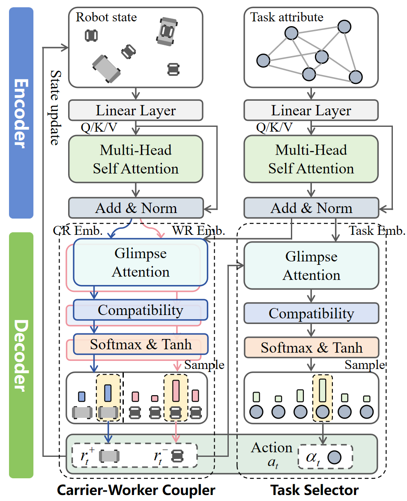

<div align="center">

# MaRS-Net: A Transformer-Based Deep Reinforcement Learning for Cooperative Scheduling in Marsupial Robotic Systems

[](https://opensource.org/licenses/MIT)
[](https://www.python.org/)
[](https://pytorch.org/)
[](https://github.com/)

**Official implementation of the paper: "MaRS-Net: A Transformer-Based Deep Reinforcement Learning for Cooperative Scheduling in Marsupial Robotic Systems"**

*Submitted to IEEE Robotics and Automation Letters (RA-L)*

</div>

---

## 📖 Introduction

**Marsupial Robotic Systems (MRS)** are increasingly deployed in complex missions by pairing large mobile carriers with smaller deployable agents. While combining global mobility with specialized local functions enhances versatility, coordinating such tightly coupled systems introduces significant challenges.

This repository presents **MaRS-Net**, a novel Deep Reinforcement Learning (DRL) framework designed to solve the **Cooperative Marsupial Scheduling Problem (CMSP)**.

The system comprises two heterogeneous robot types:
* **Carrier Robots (CRs):** Provide global inter-station transport and mobility.
* **Worker Robots (WRs):** Focus on intra-station execution and localized processing.

These agents must dynamically **couple** and **decouple** to execute tasks. As illustrated below, the collaboration follows a strictly synchronized four-stage cycle: **Docking $\to$ Fetching $\to$ Transfer $\to$ Undocking**.

<div align="center">
  
  <br>
  <em>Figure 1: The cooperative workflow of the Carrier-Worker MRS.</em>
</div>

**MaRS-Net** formulates this intricate interaction as a Markov Decision Process (MDP). It leverages a Transformer-based encoder-decoder architecture to autoregressively assemble **Carrier-Worker pairs** and assign tasks, thereby resolving strict spatiotemporal synchronization constraints and preventing deadlocks effectively.

---

## 🎥 Visualization & Demo

We provide a visualization of the Carrier-Worker collaboration within a simulated industrial environment. The demo showcases **4 CRs** and **8 WRs** collaborating to execute a sequence of tasks.

> **Note:** If the video above does not render, please view `media/Carrier_Worker_cooperation.mp4` locally.

**Legend:**

- <span style="display:inline-block;width:14px;height:14px;background:#ff4d4f;border:1px solid #000;margin-right:4px;"></span> **Source Nodes (Red):** Task fetch locations.
- <span style="display:inline-block;width:14px;height:14px;background:#52c41a;border:1px solid #000;margin-right:4px;"></span> **Destination Nodes (Green):** Designated locations for undocking and processing.
- <span style="display:inline-block;width:14px;height:14px;background:#bfbfbf;border:1px solid #000;margin-right:4px;"></span> **Processing Chambers (Grey):** Areas where WRs operate independently.
- <span style="display:inline-block;width:14px;height:14px;background:#ffffff;border:1px solid #000;margin-right:4px;"></span> **Aisle (White):** Navigable paths for Carrier Robots.

---

## 🧠 Model Architecture

MaRS-Net employs a **Hierarchical Transformer-based Encoder-Decoder** architecture tailored to the coupling constraints of heterogeneous agents.

<div align="center">
  
  <br>
  <em>Figure 2: Framework of the proposed MaRS-Net policy network.</em>
</div>

### The framework comprises two core mechanisms:

### 1. Dual-Stream Encoder
* **Task Stream:** Encodes static task attributes (e.g., source/destination coordinates, due times) via Multi-Head Self-Attention layers.
* **Robot Stream:** Encodes dynamic robot states (e.g., current location $L_r^t$, availability time $T_r^t$). These embeddings are re-computed at each decision step to reflect the real-time fleet status.

### 2. Hierarchical Decoder
The decoder adopts a **"Pair-First, Task-Second"** strategy:
* **Carrier-Worker Coupler:** Sequentially selects a compatible Carrier Robot ($r^+$) and a Worker Robot ($r^-$) to form a collaborative execution pair ($\mathcal{K}_t$).
* **Task Selector:** Conditioned on the formed pair $\mathcal{K}_t$, this module identifies the optimal task ($\alpha_t$) to execute.

This hierarchical approach ensures that the generated schedules inherently satisfy the physical coupling and temporal synchronization requirements of the MRS.

---

## ⚙️ Dependencies

The project is implemented in Python. The core environment relies on the following dependencies:

* **Python** $\ge$ 3.8
* **PyTorch** $\ge$ 1.7 (Optimized for NVIDIA GeForce 4090)
* **Gurobi** (Required for Exact Solver baselines)
* **NumPy** & **Pandas**
* **Matplotlib** (Visualization)
* **tensorboard_logger**
* **tqdm**


## 🚀 Usage
### 1. Training HAC-Net
Train the model using the REINFORCE algorithm with a greedy rollout baseline.
```bash
python run.py --graph_size 20 --run_name 'chasp_size_20'
```

### 2. Evaluation

To evaluate a pretrained model. The paper reports results using two strategies:

* **Greedy:** Deterministic selection with the highest probability.
* **Sample (Recommended):** Sampling 1280 candidate solutions and selecting the best one.

**Run evaluation with Sampling (Best Performance):**

```bash
python eval.py --datasets size_20 --model outputs/size_20 --decode_strategy sample --width 1280 --eval_batch_size 1
```

**Run evaluation with Greedy Strategy:**

```bash
python eval.py --datasets size_20 --model outputs/size_20 --decode_strategy greedy --eval_batch_size 1
```

### 4. Running Baselines

We provide a unified runner `baseline_runner.py` to execute the baseline algorithms compared in the paper, including Exact Solvers and Metaheuristics.

**Supported Algorithms:**

* `ALNS`: Adaptive Large Neighborhood Search
* `IGA`: Iterated Greedy Algorithm
* `DABC`: Discrete Artificial Bee Colony
* `DIWO`: Discrete Invasive Weed Optimization
* `Gurobi`: Exact Solver (Time limit default: 3600s)

**Execution Commands:**

```bash
# Run Metaheuristics
# Run ALNS
python baseline_runner.py --algo ALNS --file size_10/T10_I1.xlsx --iter 100 --time 3600

# Run IGA
python baseline_runner.py --algo IGA --file size_10/T10_I1.xlsx --iter 100 --time 3600

# Run DABC
python baseline_runner.py --algo DABC --file size_10/T10_I1.xlsx --iter 100 --time 3600

# Run DIWO
python baseline_runner.py --algo DIWO --file size_10/T10_I1.xlsx --iter 100 --time 3600

# Run Gurobi Exact Solver
python baseline_runner.py --algo Gurobi --file size_10/T10_I1.xlsx --iter 100 --time 3600
```