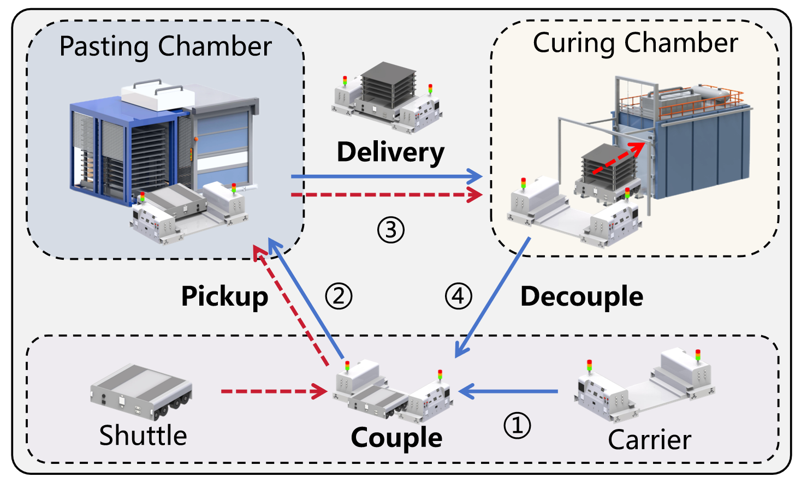

<div align="center">

# HAC-Net: A Transformer-Based Deep Reinforcement Learning Framework for Scheduling Coupled Heterogeneous AGV Systems

[](https://opensource.org/licenses/MIT)
[](https://www.python.org/)
[](https://pytorch.org/)
[](https://github.com/)

**Official implementation of the paper: "HAC-Net: A Transformer-Based Deep Reinforcement Learning for Scheduling Coupled Heterogeneous AGV Systems"**

</div>

---

## 📖 Introduction


Heterogeneous robot systems are increasingly adopted in modern industry due to their operational flexibility. However, coordinating such systems introduces substantial complexity. Motivated by real-world battery manufacturing processes, this repository presents **HAC-Net**, a novel framework designed to solve the **Coupled Heterogeneous AGV Scheduling Problem (CHASP)**.

The problem characterizes a system comprised of two complementary AGV types—**Carriers** (transport capability) and **Shuttles** (handling capability). These agents must dynamically **couple** and **decouple** to execute complex transport tasks.

As illustrated below, the cooperation follows a strictly synchronized four-stage cycle: **Couple $\to$ Pickup $\to$ Delivery $\to$ Decouple**.

<div align="center">
  
  <br>
  <em>Figure 1: The cooperative workflow of the Carrier-Shuttle system.</em>
</div>

**HAC-Net** formulates this intricate interaction as a Markov Decision Process (MDP). It leverages a Transformer-based encoder-decoder architecture to autoregressively assemble Carrier-Shuttle pairs and assign tasks, thereby resolving synchronization constraints and preventing deadlocks effectively.

---

## 🎥 Visualization & Demo

We provide a visualization of the Carrier-Shuttle collaboration within a simulated factory environment. The following demo showcases **4 Carriers** and **8 Shuttles** collaborating to execute **20 tasks**.

<div align="center">
  
</div>

> **Note:** If the video above does not render, please view `media/Carrier_shutltle_cooperation.mp4` locally.

**Legend:**

- <span style="display:inline-block;width:14px;height:14px;background:#ff4d4f;border:1px solid #000;margin-right:4px;"></span> **Source Nodes (Red):** Task origination points.
- <span style="display:inline-block;width:14px;height:14px;background:#52c41a;border:1px solid #000;margin-right:4px;"></span> **Destination Nodes (Green):** Designated locations for AGV coupling/decoupling.
- <span style="display:inline-block;width:14px;height:14px;background:#bfbfbf;border:1px solid #000;margin-right:4px;"></span> **Production Chambers (Grey):** Areas where Shuttles operate independently.
- <span style="display:inline-block;width:14px;height:14px;background:#ffffff;border:1px solid #000;margin-right:4px;"></span> **Aisle (White):** Navigable paths for Carriers.


---

## 🧠 Model Architecture

HAC-Net employs a **Hierarchical Transformer-based Encoder-Decoder** architecture tailored to the coupling constraints of heterogeneous agents.

<!-- <div align="center">
  
  <br>
  <em>Figure 2: Framework of the proposed HAC-Net policy network.</em>
</div> -->


https://github.com/user-attachments/assets/f2671e3b-dd2d-4522-8484-139fc7cf50fc


### The framework comprises two core mechanisms:

### 1. Dual-Stream Encoder
* **Task Stream:** Encodes static task attributes (e.g., source/destination coordinates, due times) via Multi-Head Self-Attention layers.
* **AGV Stream:** Encodes dynamic AGV states (e.g., current location $l_t$, availability time $\tau_t$). These embeddings are updated at each decision step to reflect the real-time environment status.

### 2. Hierarchical Decoder
* **Carrier-Shuttle Coupler:** Selects a compatible Carrier ($r^+$) and Shuttle ($r^-$) pair based on the fused embeddings to form a collaborative unit.
* **Task Selector:** Conditioned on the selected pair, this module assigns the optimal task ($\alpha_t$) to the unit.

This hierarchical approach ensures that the generated schedules inherently satisfy the physical and temporal synchronization constraints of the CHASP.

---

## ⚙️ Dependencies

The project is implemented in Python. The core environment relies on the following dependencies:

* **Python** $\ge$ 3.8
* **PyTorch** $\ge$ 1.7 (Optimized for NVIDIA GeForce 4090)
* **Gurobi** (Required for Exact Solver baselines)
* **NumPy** & **Pandas**
* **Matplotlib** (Visualization)
* **tensorboard_logger**
* **tqdm**


## 🚀 Usage
### 1. Training HAC-Net
Train the model using the REINFORCE algorithm with a greedy rollout baseline.
```bash
python run.py --graph_size 20 --run_name 'chasp_size_20'
```

### 2. Evaluation

To evaluate a pretrained model. The paper reports results using two strategies:

* **Greedy:** Deterministic selection with the highest probability.
* **Sample (Recommended):** Sampling 1280 candidate solutions and selecting the best one.

**Run evaluation with Sampling (Best Performance):**

```bash
python eval.py --datasets size_20 --model outputs/size_20 --decode_strategy sample --width 1280 --eval_batch_size 1
```

**Run evaluation with Greedy Strategy:**

```bash
python eval.py --datasets size_20 --model outputs/size_20 --decode_strategy greedy --eval_batch_size 1
```

### 4. Running Baselines

We provide a unified runner `baseline_runner.py` to execute the baseline algorithms compared in the paper, including Exact Solvers and Metaheuristics.

**Supported Algorithms:**

* `ALNS`: Adaptive Large Neighborhood Search
* `IGA`: Iterated Greedy Algorithm
* `DABC`: Discrete Artificial Bee Colony
* `DIWO`: Discrete Invasive Weed Optimization
* `Gurobi`: Exact Solver (Time limit default: 3600s)

**Execution Commands:**

```bash
# Run Metaheuristics
# Run ALNS
python baseline_runner.py --algo ALNS --file size_10/T10_I1.xlsx --iter 100 --time 3600

# Run IGA
python baseline_runner.py --algo IGA --file size_10/T10_I1.xlsx --iter 100 --time 3600

# Run DABC
python baseline_runner.py --algo DABC --file size_10/T10_I1.xlsx --iter 100 --time 3600

# Run DIWO
python baseline_runner.py --algo DIWO --file size_10/T10_I1.xlsx --iter 100 --time 3600

# Run Gurobi Exact Solver
python baseline_runner.py --algo Gurobi --file size_10/T10_I1.xlsx --iter 100 --time 3600
```
